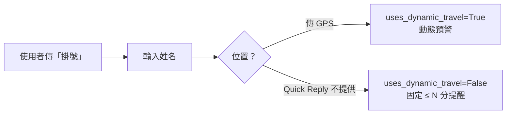

# MedIntro POC｜線上候診掛號與動態／固定時間預警

本專案為**概念驗證（POC）**：病患可透過 **網頁** 或 **LINE 官方帳號** 掛號，系統依「目前叫號、您的前方人數、（可選）路程時間」決定是否在適當時間透過 **Email** 或 **LINE** 發送「建議準備／出發」提醒。後端為 **FastAPI + SQLite**，前端為 **Vue 3 + Vite**。

---

## 目錄

- [專案能做什麼](#專案能做什麼)
- [整體作用機轉](#整體作用機轉)
- [技術棧與目錄結構](#技術棧與目錄結構)
- [環境需求](#環境需求)
- [本機開發與執行](#本機開發與執行)
- [環境變數說明](#環境變數說明)
- [LINE 官方帳號串接](#line-官方帳號串接)
- [Google Maps（選用但建議）](#google-maps選用但建議)
- [候診預警邏輯詳解](#候診預警邏輯詳解)
- [主要 HTTP API](#主要-http-api)
- [部署到伺服器／雲端時的注意事項](#部署到伺服器雲端時的注意事項)
- [限制與免責](#限制與免責)

---

## 專案能做什麼

| 類型 | 功能 |
|------|------|
| **網頁** | 掛號（姓名、Email 或 LINE User ID、座標、交通工具模式）、進入等候大廳頁查看最新叫號與預估等候 |
| **LINE** | 「**掛號**」對話流程：姓名 → 提供 GPS 或以 Quick Reply **不提供位置**；「**查詢**」顯示目前叫號、自己的號碼、前方人數、預警模式說明 |
| **後台排程** | 週期掃描等候中的掛號，符合條件則發送 Email／LINE（與 `POST /api/queue/warning-scan-now` 同源） |
| **叫號模擬** | `POST /api/queue/advance-next` 將診間「目前叫號」+1（POC 用） |
| **開發輔助** | 選用 **pyngrok** 自動對外網址；`GET /api/ngrok/status` 可查 Webhook 完整 URL |

---

## 整體作用機轉

### 1. 資料與狀態

- **`users`**：姓名、Email（可空）、`line_id`（LINE User ID，可空；網頁掛號可手填，LINE 掛號由 Webhook 帶入）。
- **`queue_info`**：掛號序號、病患座標、交通模式、預估交通分鐘（可空）、是否已發預警、`uses_dynamic_travel`（是否使用「動態路程 + 等候−路程」公式）、狀態（等候中等）。
- **`clinic_state`**：單例列，記錄診間**目前叫到的號碼** `current_serving_number`。

啟動時會 `create_all` 建表；若使用既有 **SQLite** 舊庫，會自動執行輕量補欄位（例如 `queue_info.uses_dynamic_travel`）。

### 2. 預估等候時間（POC 假設）

- 每位尚未被叫到的使用者，**粗略假設再等 5 分鐘／人**（僅 POC 用，非真實診療時間模型）。
- 「在您前面的人數」＝ `queue_number` 與 `current_serving_number` 的差值衍算（見後端 `people_before`）。

### 3. 預警通知通道

- 排程（APScheduler）依間隔呼叫 `run_warning_scan`。
- 若同時未設定可用 **SMTP** 與 **LINE Messaging**，掃描仍會更新／計算條件，但**不會實際發送**（並於回傳統計中註記）。

### 4. Google Maps 的角色（動態模式）

- 若已設定 API Key 與診所座標／地址，後端可對「診所 ↔ 病患座標」呼叫 **Routes API** 更新 `estimated_travel_time_minutes`。
- 診所座標可來自環境變數，或由 **Geocoding** 將 `CLINIC_ADDRESS` 轉成座標並快取於程序內（啟動時 warm）。

### 5. LINE Webhook 與對話狀態

- LINE Platform 將事件 **POST** 至 `/api/line/webhook`，後端驗證 **`X-Line-Signature`** 後，逐筆事件交給 `flush_event`。
- **重要**：LINE 的 **`replyToken` 每則事件只能使用一次**，因此掛號完成時只會發**一則**回覆（含成功說明），不會在中途多送一則佔用 token。
- 掛號多步對話狀態暫存於程序記憶體（**程序重啟即消失**；正式環境應改 Redis／DB，此為 POC 取捨）。

---

## 技術棧與目錄結構

**後端**：Python 3、FastAPI、SQLAlchemy 2、APScheduler、httpx、pyngrok、pydantic-settings  

**前端**：Vue 3、Vue Router、Vite、Element Plus、Tailwind（建置用）

```
medintro/
├── backend/
│   ├── app/
│   │   ├── main.py              # FastAPI 入口、lifespan（建表、排程、ngrok）
│   │   ├── config.py            # 環境變數設定
│   │   ├── models.py            # ORM 模型
│   │   ├── crud.py              # 掛號、叫號、查詢
│   │   ├── database_schema.py   # SQLite 補欄位
│   │   ├── api/routes/          # queue / line / maps / mail
│   │   └── services/            # warning_job, line_bot_flow, google_maps, mail, ngrok_tunnel …
│   ├── requirements.txt
│   └── .env.example
├── frontend/
│   ├── src/
│   │   ├── views/RegisterPage.vue
│   │   ├── views/LobbyPage.vue
│   │   └── router/index.js      # "/" 掛號, "/lobby/:queueId" 大廳
│   ├── vite.config.js           # 開發時 /api → http://127.0.0.1:8000
│   └── package.json
└── README.md
```

---

## 環境需求

- **Python** 3.10+（建議）
- **Node.js** 18+（前端開發／建置）
- **LINE Developers** 帳號與 Messaging API 通道（若要用 LINE）
- **Google Cloud** 專案並啟用 Geocoding API、Routes API（若要用真實路程；否則仍可用 fallback 分鐘模擬動態門檻的一部分行為）

---

## 本機開發與執行

### 後端

```bash
cd backend
python -m venv .venv
# Windows: .venv\Scripts\activate
# macOS/Linux: source .venv/bin/activate
pip install -r requirements.txt
copy .env.example .env   # 或手動建立 .env 並依下節填寫
```

**請在 `backend` 目錄下啟動**，以便預設 `sqlite:///./medintro.db` 路徑符合預期：

```bash
uvicorn app.main:app --reload --host 127.0.0.1 --port 8000
```

- API 文件：<http://127.0.0.1:8000/docs>  
- 健康檢查：<http://127.0.0.1:8000/health>  

### 前端

```bash
cd frontend
npm install
npm run dev
```

開發伺服器預設 <http://127.0.0.1:5173>，並將 `/api`、`/health` **代理**到 `8000` 埠。

### 建置前端（靜態檔）

```bash
cd frontend
npm run build
```

產出於 `frontend/dist/`。正式環境可由 **Nginx**、**Caddy** 或 FastAPI `StaticFiles` 提供（需自行掛載與設定 SPA fallback）。

---

## 環境變數說明

完整範例見 `backend/.env.example`。以下補充程式中常用但範例檔可能未列出的項目：

| 變數 | 說明 |
|------|------|
| `DATABASE_URL` | 預設 SQLite；亦支援其他 SQLAlchemy URL（部署時可改 PostgreSQL 等，需自行驗證相容性） |
| `BACKEND_CORS_ORIGINS` | 前端來源逗號分隔，預設含 Vite `5173` |
| `SMTP_*` / `SMTP_ENABLED` | 寄信；`MAIL_TEST_ENDPOINT_ENABLED` 開啟後才允許測試寄信 API |
| `SCHEDULER_ENABLED` | `false` 時整段預警掃描略過 |
| `WARNING_POLL_INTERVAL_SECONDS` | 排程間隔（秒） |
| `WARNING_SCAN_ON_STARTUP` | 是否在啟動後立即跑一次掃描 |
| `WARNING_TRAVEL_MINUTES_FALLBACK` | 動態模式下，資料庫尚無交通分鐘時代入的預設「路程分鐘」 |
| **`LINE_STATIC_REMINDER_MINUTES`** | **預設 15**。LINE 掛號「不提供位置」時，當 **預估等候 ≤ 此分鐘** 即觸發固定提前提醒 |
| `GOOGLE_MAPS_API_KEY` | 後端專用，勿暴露於前端 |
| `CLINIC_LATITUDE` / `CLINIC_LONGITUDE` / `CLINIC_ADDRESS` | 診所位置；地址與座標二擇一或併用（見 Geocoding 邏輯） |
| `LINE_CHANNEL_SECRET` / `LINE_CHANNEL_ACCESS_TOKEN` | LINE Messaging API |
| `LINE_TEST_ENDPOINT_ENABLED` | 是否開放 `POST /api/line/test-push`（僅測試用） |
| `NGROK_ENABLED` / `NGROK_AUTHTOKEN` / `NGROK_LISTEN_PORT` | 本機對外隧道；**`NGROK_LISTEN_PORT` 必須與 uvicorn `--port` 一致** |

---

## LINE 官方帳號串接

1. 於 [LINE Developers](https://developers.line.biz/) 建立 Provider 與 **Messaging API** 通道，取得 **Channel secret** 與 **Channel access token（長期）**，填入 `.env`。
2. **Webhook URL** 必須為 HTTPS 公開網址。本機開發可：
   - 設定 `NGROK_ENABLED=true` 與 `NGROK_AUTHTOKEN`，啟動後端後開啟 `GET /api/ngrok/status` 取得 `line_webhook_url`；或
   - 自行使用 ngrok CLI／雲端隧道，指向 `https://你的網域/api/line/webhook`。
3. 在 LINE Developers 主控台啟用 **Webhook**、必要時關閉自動回覆以免與 Bot 邏輯衝突（依官方文件調整）。
4. 使用者須 **加官方帳號為好友**；Messaging API 的 **User ID** 與公開的「使用者名稱／@ID」不同，網頁掛號若填 LINE 字段需使用官方事件中的 User ID（舊版測試可透過伺服器 Log 或由 `POST /api/line/test-push` 驗證 Channel 是否正常）。

### LINE 使用者流程（摘要）



- **查詢**：傳「查詢」等關鍵字，回傳目前叫號、自己的號碼、前方人數與預警模式文字說明。

---

## Google Maps（選用但建議）

1. 在 Google Cloud Console 建立 API Key，**限制為後端 IP 或適當來源**，並啟用 **Geocoding API**、**Routes API**。
2. 設定 `GOOGLE_MAPS_API_KEY` 以及診所 `CLINIC_ADDRESS` 或座標。
3. 呼叫 `GET /api/maps/clinic-status` 可確認金鑰、路由是否就緒與診所座標解析狀態（詳見回應內文字）。

---

## 候診預警邏輯詳解

對每一筆 **狀態為等候中** 且 **尚未發過預警** 的 `queue_info`：

### A. 動態模式（`uses_dynamic_travel=True`）

- 典型：**網頁掛號**、LINE 掛號且使用者**傳送位置訊息**。
- 若 Maps 設定完成，後端會嘗試更新 **預估交通分鐘** `estimated_travel_time_minutes`。
- 若仍無值，則代入 `WARNING_TRAVEL_MINUTES_FALLBACK`（預設 25）。
- **觸發條件**：令 `wait_min`＝預估等候分鐘（前方人數 × 5），`travel`＝預估交通分鐘，則  

  **`wait_min − travel ≤ 5`** 時發送通知（概念：再不出發可能將超過路途緩衝）。

### B. 固定提前模式（`uses_dynamic_travel=False`）

- 典型：**LINE 掛號**且使用者選 **不提供位置**（座標在 DB 可能為 0,0；**不再依賴 Maps 路程**）。
- **觸發條件**：**`wait_min ≤ LINE_STATIC_REMINDER_MINUTES`**（預設 15）。
- 通知文案會註明為「先前未分享位置」的固定提前說明。

### 發送與紀錄

- 優先視使用者是否有 **Email**、**LINE User ID** 與通道是否已設定；可同時發兩路（若皆可）。
- 任一路成功送出後，會將 **`notification_sent = True`**，避免重複推播。

---

## 主要 HTTP API

| 方法 | 路徑 | 說明 |
|------|------|------|
| POST | `/api/queue/register` | 網頁掛號 |
| GET | `/api/queue/hall/{queue_id}` | 等候大廳狀態 |
| POST | `/api/queue/advance-next` | 叫下一位（模擬） |
| POST | `/api/queue/warning-scan-now` | 手動跑一次預警掃描 |
| POST | `/api/line/webhook` | LINE Webhook（簽章驗證） |
| POST | `/api/line/test-push` | 測試 Push（須 `LINE_TEST_ENDPOINT_ENABLED=true`） |
| GET | `/api/ngrok/status` | ngrok 啟動時回傳 public URL 與 Webhook 路徑 |
| GET | `/api/maps/clinic-status` | Maps／診所座標診斷 |
| POST | `/api/mail/test-send` | 測試寄信（須 SMTP 與開關，見設定） |

根路徑 `GET /` 回傳導覽 JSON。

---

## 部署到伺服器／雲端時的注意事項

1. **程序管理**：使用 **systemd、gunicorn+uvicorn workers、Docker、或雲平台託管**，確保重啟自動拉起；設定與監聽埠一致。
2. **HTTPS**：LINE Webhook **必須 HTTPS**；由反向代理終止 TLS。
3. **關閉開發用功能**：正式環境建議 **`NGROK_ENABLED=false`**、`MAIL_TEST_ENDPOINT_ENABLED=false`、`LINE_TEST_ENDPOINT_ENABLED=false`。
4. **Secrets**：仅以環境變數或密钥管理服务注入 **Channel secret、Access token、Maps Key、SMTP 密碼**，勿提交至版本庫。
5. **資料庫**：SQLite 適合單機 POC；多用戶／高可用請評估 **PostgreSQL** 等並調整連線與備份策略。
6. **LINE 狀態**：目前對話草稿在記憶體；多程序／多機部署時會不一致，須另行保存 session。
7. **CORS**：將 `BACKEND_CORS_ORIGINS` 設為實際前端網域。
8. **前端**：`npm run build` 後將 `dist` 交由靜態伺服器；API 請指向同一網域或另行設定 **反向代理** 與 **CORS**。

### Docker（範略）

專案未內附官方 `Dockerfile`；可自行撰寫多階段映像：**一階段建置 frontend `dist`**、**一階段安裝 backend 依賴**，再以 `uvicorn` 搭配靜態掛載或分離網頁伺服器部署。

---

## 限制與免責

- 本專案為 **POC**：候診時間為簡化假設、無正式資安稽核與 HIPAA／個資合規宣告。
- LINE／Google／郵件服務之配額、條款與資安責任由使用者自行遵循。
- 生產環境請補齊驗證、權限、稽核、備援與醫療法規諮詢後再使用。

---

若你僅需「能跑的示範」：後端 `8000` + 前端 `5173` + 填好 LINE 與（選用）Maps，即可完整體驗掛號、叫號、預警與 LINE 對話流程。
